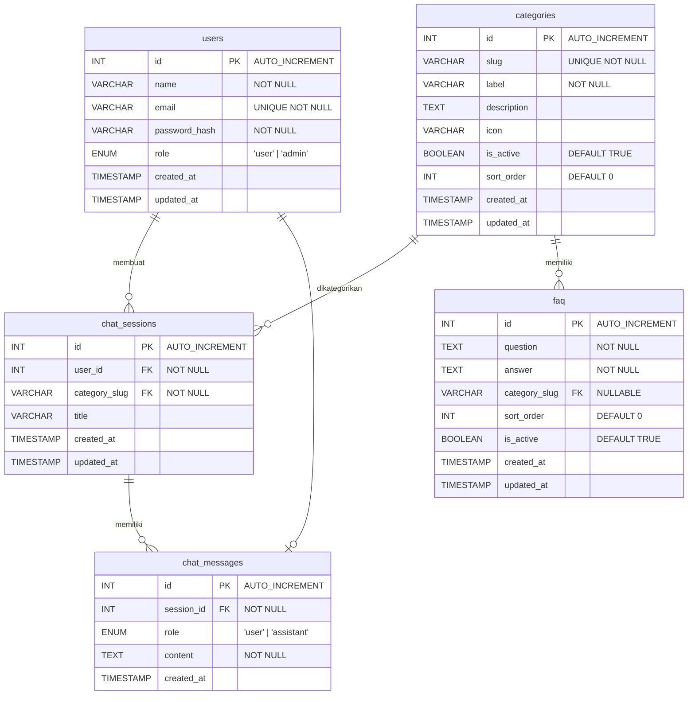

# BAB 4 — Database Schema

**LegalAid AI — Konsultasi Hukum Digital untuk Masyarakat Indonesia**

> Pada versi 2.0, LegalAid AI menggunakan **MySQL 8** yang di-manage oleh **Railway** sebagai database server-side. Bagian ini mendokumentasikan struktur database aktual dan struktur data localStorage untuk guest.

---

## 4.1 Struktur Data localStorage (Guest — Tanpa Login)

Data disimpan dalam Pinia store yang disinkronisasi ke localStorage oleh `pinia-plugin-persistedstate`.

### 4.1.1 Objek: `chatStore` (sessionStorage)

| Field | Tipe Data | Nilai Default | Keterangan |
|---|---|---|---|
| `messages` | `Array<Message>` | `[]` | Array pesan dalam sesi aktif |
| `category` | `String \| null` | `null` | Kategori hukum aktif |
| `isLoading` | `Boolean` | `false` | Status menunggu respons AI |

### 4.1.2 Objek: `historyStore` (localStorage)

| Field | Tipe Data | Keterangan |
|---|---|---|
| `sessions` | `Array<Session>` | Semua sesi percakapan yang sudah disimpan |

### 4.1.3 Objek: `Message`

| Field | Tipe Data | Contoh Nilai | Keterangan |
|---|---|---|---|
| `id` | `String (UUID v4)` | `"550e8400-e29b-..."` | Identifier unik per pesan |
| `role` | `String (Enum)` | `"user" \| "assistant"` | Pengirim pesan |
| `content` | `String` | `"Apa hak saya jika di-PHK?"` | Isi teks pesan |
| `timestamp` | `String (ISO 8601)` | `"2026-06-01T09:00:00.000Z"` | Waktu pesan dibuat |
| `category` | `String` | `"ketenagakerjaan"` | Konteks kategori saat pesan dibuat |

### 4.1.4 Objek: `Session` (historyStore)

| Field | Tipe Data | Keterangan |
|---|---|---|
| `id` | `String (UUID v4)` | Identifier unik sesi |
| `category` | `String` | Kategori hukum sesi |
| `title` | `String` | Judul sesi |
| `messages` | `Array<Message>` | Semua pesan dalam sesi |
| `createdAt` | `String (ISO 8601)` | Waktu sesi dibuat |
| `updatedAt` | `String (ISO 8601)` | Waktu pesan terakhir |

---

## 4.2 Database MySQL (Versi 2.0 — Aktual)

Database MySQL 8 di-host di Railway. Schema terdiri dari 5 tabel dengan relasi foreign key.

---

### 4.2.1 Entity Relationship Diagram (Mermaid)



**Keterangan Relasi:**

| Relasi | Tipe | FK | On Delete |
|---|---|---|---|
| `users` → `chat_sessions` | One-to-Many | `chat_sessions.user_id` → `users.id` | CASCADE |
| `categories` → `chat_sessions` | One-to-Many | `chat_sessions.category_slug` → `categories.slug` | RESTRICT |
| `chat_sessions` → `chat_messages` | One-to-Many | `chat_messages.session_id` → `chat_sessions.id` | CASCADE |
| `categories` → `faq` | One-to-Many | `faq.category_slug` → `categories.slug` | SET NULL |

---

### 4.2.2 ERD — Deskripsi Relasi Antar Entitas

| Entitas | Primary Key | Atribut Utama | Relasi |
|---|---|---|---|
| `users` | `id (INT, AI)` | `name`, `email (UNIQUE)`, `password_hash`, `role (ENUM)` | 1 user → MANY chat_sessions |
| `categories` | `id (INT, AI)` | `slug (UNIQUE)`, `label`, `description`, `icon`, `is_active`, `sort_order` | 1 category → MANY chat_sessions, MANY faq |
| `chat_sessions` | `id (INT, AI)` | `user_id (FK)`, `category_slug (FK)`, `title` | 1 session → MANY chat_messages; MANY sessions → 1 user |
| `chat_messages` | `id (INT, AI)` | `session_id (FK)`, `role (ENUM)`, `content` | MANY messages → 1 session |
| `faq` | `id (INT, AI)` | `question`, `answer`, `category_slug (FK)`, `sort_order`, `is_active` | MANY faq → 1 category (nullable) |

**Kardinalitas:** `users(1) ─── chat_sessions(N) ─── chat_messages(N)` dan `categories(1) ─── faq(N)`

---

### 4.2.2 Tabel: `users`

```sql
CREATE TABLE IF NOT EXISTS users (
  id INT AUTO_INCREMENT PRIMARY KEY,
  name VARCHAR(100) NOT NULL,
  email VARCHAR(255) NOT NULL UNIQUE,
  password_hash VARCHAR(255) NOT NULL,
  role ENUM('user', 'admin') DEFAULT 'user',
  created_at TIMESTAMP DEFAULT CURRENT_TIMESTAMP,
  updated_at TIMESTAMP DEFAULT CURRENT_TIMESTAMP ON UPDATE CURRENT_TIMESTAMP
);
```

| Kolom | Tipe | Constraint | Keterangan |
|---|---|---|---|
| `id` | INT | PRIMARY KEY, AUTO_INCREMENT | Identifier unik pengguna |
| `name` | VARCHAR(100) | NOT NULL | Nama lengkap pengguna |
| `email` | VARCHAR(255) | UNIQUE, NOT NULL | Email untuk autentikasi |
| `password_hash` | VARCHAR(255) | NOT NULL | Password hash (bcryptjs, 10 rounds) |
| `role` | ENUM | DEFAULT 'user' | `'user'` atau `'admin'` |
| `created_at` | TIMESTAMP | DEFAULT CURRENT_TIMESTAMP | Waktu registrasi |
| `updated_at` | TIMESTAMP | AUTO-UPDATE | Waktu update terakhir |

**Admin seed:** `admin@legalaid.ai` / `admin123` (dibuat oleh `seed.js`)

---

### 4.2.3 Tabel: `categories`

```sql
CREATE TABLE IF NOT EXISTS categories (
  id INT AUTO_INCREMENT PRIMARY KEY,
  slug VARCHAR(50) NOT NULL UNIQUE,
  label VARCHAR(100) NOT NULL,
  description TEXT,
  icon VARCHAR(50),
  is_active BOOLEAN DEFAULT TRUE,
  sort_order INT DEFAULT 0,
  created_at TIMESTAMP DEFAULT CURRENT_TIMESTAMP,
  updated_at TIMESTAMP DEFAULT CURRENT_TIMESTAMP ON UPDATE CURRENT_TIMESTAMP
);
```

| Kolom | Tipe | Constraint | Keterangan |
|---|---|---|---|
| `id` | INT | PRIMARY KEY, AUTO_INCREMENT | Identifier unik kategori |
| `slug` | VARCHAR(50) | UNIQUE, NOT NULL | Slug URL-safe (e.g., `'ketenagakerjaan'`) |
| `label` | VARCHAR(100) | NOT NULL | Nama tampil (e.g., `'Ketenagakerjaan'`) |
| `description` | TEXT | NULLABLE | Deskripsi kategori |
| `icon` | VARCHAR(50) | NULLABLE | Nama icon |
| `is_active` | BOOLEAN | DEFAULT TRUE | Status aktif/nonaktif |
| `sort_order` | INT | DEFAULT 0 | Urutan tampil |

**Default categories (6):** ketenagakerjaan, konsumen, keluarga, pertanahan, pidana, utang_kredit

---

### 4.2.4 Tabel: `chat_sessions`

```sql
CREATE TABLE IF NOT EXISTS chat_sessions (
  id INT AUTO_INCREMENT PRIMARY KEY,
  user_id INT NOT NULL,
  category_slug VARCHAR(50) NOT NULL,
  title VARCHAR(255),
  created_at TIMESTAMP DEFAULT CURRENT_TIMESTAMP,
  updated_at TIMESTAMP DEFAULT CURRENT_TIMESTAMP ON UPDATE CURRENT_TIMESTAMP,
  FOREIGN KEY (user_id) REFERENCES users(id) ON DELETE CASCADE,
  FOREIGN KEY (category_slug) REFERENCES categories(slug),
  INDEX idx_user_sessions (user_id, updated_at DESC)
);
```

| Kolom | Tipe | Constraint | Keterangan |
|---|---|---|---|
| `id` | INT | PRIMARY KEY, AUTO_INCREMENT | Identifier unik sesi |
| `user_id` | INT | FK → users(id) ON DELETE CASCADE | Pemilik sesi |
| `category_slug` | VARCHAR(50) | FK → categories(slug) | Kategori hukum sesi |
| `title` | VARCHAR(255) | NULLABLE | Judul sesi (auto-generated) |
| `created_at` | TIMESTAMP | DEFAULT CURRENT_TIMESTAMP | Waktu sesi dibuat |
| `updated_at` | TIMESTAMP | AUTO-UPDATE | Waktu pesan terakhir |

**Indeks:** `idx_user_sessions (user_id, updated_at DESC)` — mempercepat query riwayat pengguna

---

### 4.2.5 Tabel: `chat_messages`

```sql
CREATE TABLE IF NOT EXISTS chat_messages (
  id INT AUTO_INCREMENT PRIMARY KEY,
  session_id INT NOT NULL,
  role ENUM('user', 'assistant') NOT NULL,
  content TEXT NOT NULL,
  created_at TIMESTAMP DEFAULT CURRENT_TIMESTAMP,
  FOREIGN KEY (session_id) REFERENCES chat_sessions(id) ON DELETE CASCADE,
  INDEX idx_session_messages (session_id, created_at ASC)
);
```

| Kolom | Tipe | Constraint | Keterangan |
|---|---|---|---|
| `id` | INT | PRIMARY KEY, AUTO_INCREMENT | Identifier unik pesan |
| `session_id` | INT | FK → chat_sessions(id) ON DELETE CASCADE | Sesi pemilik pesan |
| `role` | ENUM | NOT NULL | `'user'` atau `'assistant'` |
| `content` | TEXT | NOT NULL | Isi teks pesan |
| `created_at` | TIMESTAMP | DEFAULT CURRENT_TIMESTAMP | Waktu pesan dikirim |

**Indeks:** `idx_session_messages (session_id, created_at ASC)` — mempercepat query pesan per sesi

---

### 4.2.6 Tabel: `faq`

```sql
CREATE TABLE IF NOT EXISTS faq (
  id INT AUTO_INCREMENT PRIMARY KEY,
  question TEXT NOT NULL,
  answer TEXT NOT NULL,
  category_slug VARCHAR(50),
  sort_order INT DEFAULT 0,
  is_active BOOLEAN DEFAULT TRUE,
  created_at TIMESTAMP DEFAULT CURRENT_TIMESTAMP,
  updated_at TIMESTAMP DEFAULT CURRENT_TIMESTAMP ON UPDATE CURRENT_TIMESTAMP,
  FOREIGN KEY (category_slug) REFERENCES categories(slug) ON DELETE SET NULL
);
```

| Kolom | Tipe | Constraint | Keterangan |
|---|---|---|---|
| `id` | INT | PRIMARY KEY, AUTO_INCREMENT | Identifier unik FAQ |
| `question` | TEXT | NOT NULL | Pertanyaan |
| `answer` | TEXT | NOT NULL | Jawaban |
| `category_slug` | VARCHAR(50) | FK → categories(slug) ON DELETE SET NULL, NULLABLE | Kategori terkait (opsional) |
| `sort_order` | INT | DEFAULT 0 | Urutan tampil |
| `is_active` | BOOLEAN | DEFAULT TRUE | Status aktif/nonaktif |

---

## 4.3 Database Connection

```javascript
// backend/src/config/db.js
import mysql from 'mysql2/promise'

const pool = mysql.createPool({
  host: env.db.host,        // MYSQLHOST dari Railway
  port: env.db.port,        // MYSQLPORT dari Railway
  user: env.db.user,        // MYSQLUSER dari Railway
  password: env.db.password, // MYSQLPASSWORD dari Railway
  database: env.db.database, // MYSQLDATABASE dari Railway
  connectionLimit: 10,
})
```

**Catatan Penting:** MySQL prepared statements (`pool.execute`) tidak mendukung parameterisasi `LIMIT` dan `OFFSET`. Untuk query dengan LIMIT/OFFSET, gunakan `pool.query` dengan nilai yang di-interpolate langsung (nilai sudah di-sanitize sebagai integer).

---

## 4.4 Migration & Seed

- **Migration** (`db/migrate.js`): Membaca `schema.sql` dan mengeksekusi setiap pernyataan CREATE TABLE
- **Seed** (`db/migrate.js` → `db/seed.js`): Menyisipkan 6 kategori default, 4 FAQ, dan 1 admin user
- **Startup sequence** (`app.js`): `testConnection()` → `migrate()` → `startServer()`

---

*LegalAid AI — SDD v2.0 | STMIK Lombok 2026 | Sucianti — SI20230032 & Wulandari — SI20230035*
